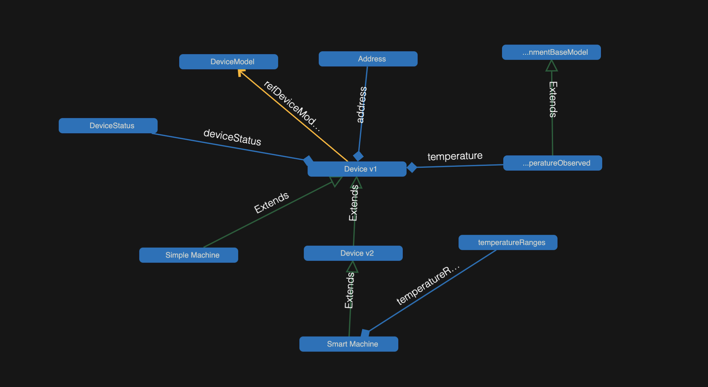

# POC Azure IOT HUB - Ontology with Digital Twin Definition Language (DTDL)

**Show the power of Ontology in the Digital Twins Definition Language universe to build powerful and sustainable devices.**


### :crystal_ball: About


This proof of concept uses some components from the [Digital Twins Definition Language (DTDL) ontology for Smart Cities](https://github.com/Azure/opendigitaltwins-smartcities) to build two simple products to illustrate the ontology's capabilities, including extensive testing to validate the model's integrity and evolution over time.


#### DTDL and Ontology

Ontology is a powerful, versatile tool in the Azure Digital Twins Definition Language (DTDL) universe. This powerful and efficient framework allows developers and industrial experts to create reliable and sustainable devices by making use of a common object model, ontology, and digital twins. Utilizing ontology, Azure DTDL provides an efficient and consistent way to describe physical environments and devices and their relationships. This makes it possible for developers to quickly deploy, manage, and maintain sophisticated products and solutions for their organizations.

Ontology works by defining a common set of terms and concepts that describe physical infrastructure, objects, and activities in the system. With this, developers can build models that enable the business to create sophisticated solutions and products with a predetermined set of data points and functions. This allows them to create more efficient and better-performing solutions that are tailored to the specific needs of their businesses.

Furthermore, ontology allows developers to create reuseable and consistent models across multiple departments and organizations. This capability promotes scalability and sustainability by allowing developers to use the same models in different environments. As well, they can easily share and update models as changes are made to the environment. This ensures that products are always up-to-date with the latest technologies and industry standards.

In summary, ontology is a powerful tool in the Azure Digital Twins Definition Language (DTDL) universe, providing developers and industrial experts with an efficient and flexible framework to create reliable and sustainable devices. By utilizing ontology, developers can quickly deploy, manage, and maintain sophisticated solutions and products that can be easily reused and updated as needed. This allows organizations to maintain scalability and sustainability of their solutions, as well as ensure that their products are always up-to-date with the latest technologies and industry standards.


**References**
- [Azure | What is an ontology?](https://learn.microsoft.com/en-us/azure/digital-twins/concepts-ontologies)
- [Azure | Adopting a DTDL industry ontology](https://learn.microsoft.com/en-us/azure/digital-twins/concepts-ontologies-adopt)
- [Azure | Extending ontologies](https://learn.microsoft.com/en-us/azure/digital-twins/concepts-ontologies-extend)


### 📺 Tutorial


__soon__


### :tada: Features 

- Several interfaces and relationships included to build bigger models
- Tests included to check the models integrity and relationship between them.
- Components and tests with support for versioning
- Components and Interfaces inherit
- Commands, Telemetry and properties integrated

### :shipit: Model Graph




[Azure Digital Twins Explorer](https://learn.microsoft.com/en-us/azure/digital-twins/concepts-azure-digital-twins-explorer) is a powerful visualization tool for understanding models and their relationships. With this tool, users can quickly identify the components and interfaces of any given model. It simplifies the process of understanding models and their related components, providing a more productive and efficient way to approach data modeling.


**References**
- [RealEstateCore, a smart building ontology for digital twins, is now available](https://techcommunity.microsoft.com/t5/internet-of-things-blog/realestatecore-a-smart-building-ontology-for-digital-twins-is/ba-p/1914794)
- [Visualize your models and twins with Azure Digital Twins Explorer](https://techcommunity.microsoft.com/t5/internet-of-things-blog/visualize-your-models-and-twins-with-azure-digital-twins/ba-p/2374150)


### :satellite: Usage

Download the source code
```bash
git clone https://github.com/UlisesGascon/POC-azure-IOT-DTDL-ontology
cd POC-azure-IOT-DTDL-ontology
```

Install the project dependencies 
```bash
nvm use
npm i
```

Run the linter:
```bash
npm run lint
npm run lint:fix
```

Run the tests:
```bash
npm run test
npm run test:coverage
```
